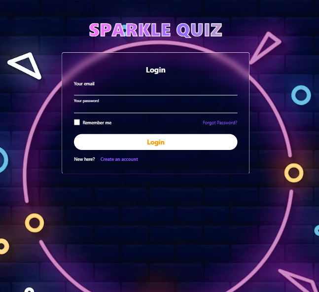
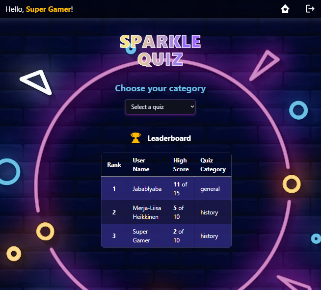
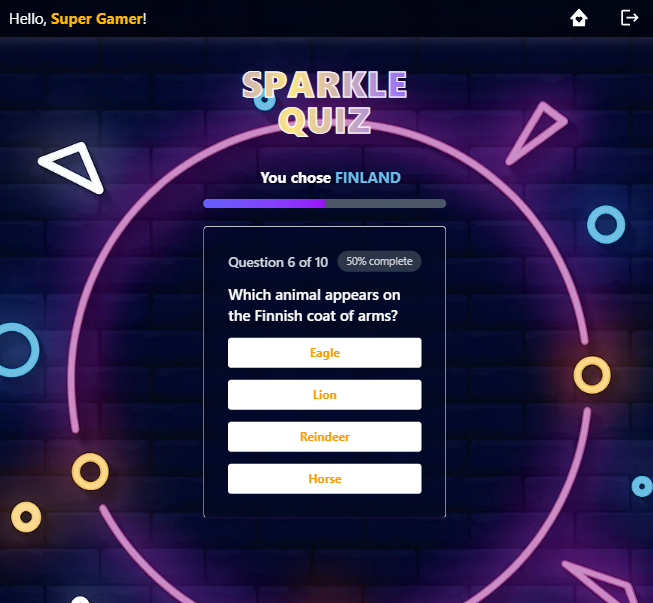
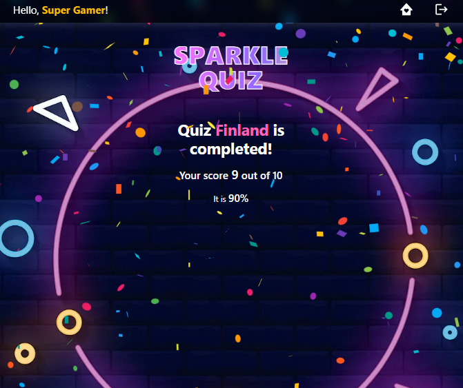

# SparkleQuiz ✨ 
This application is fast, fun and colorful. SparkleQuiz has different categories like General, History, Celebrities and more.
It is designed for quick learning and entertainment. Users can test their knowledge and explore various topics.

## Tech Stack:
1. Frontend: React + Tailwind 
2. Backend: Node.js + Express + MongoDB
3. Other: Axios, JWT Auth, Confetti animation, etc.

### App screens:
- Login page:

- Main page:

- Quiz page:

- User's result:
